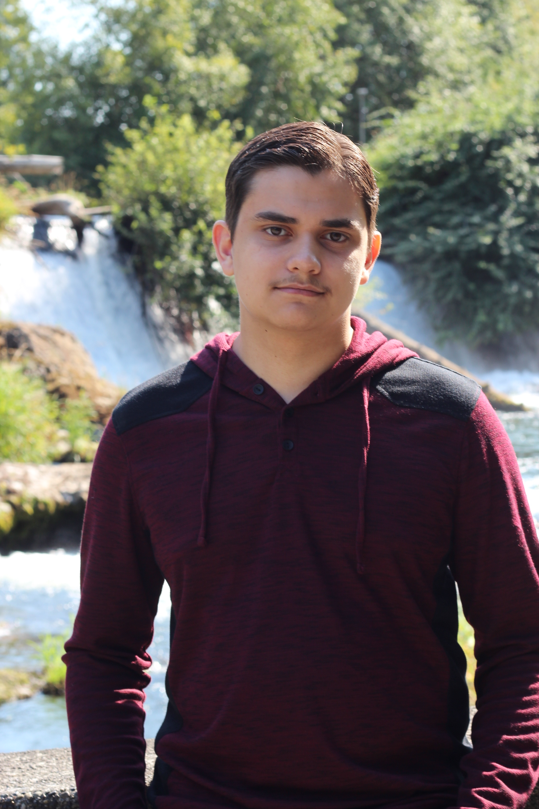
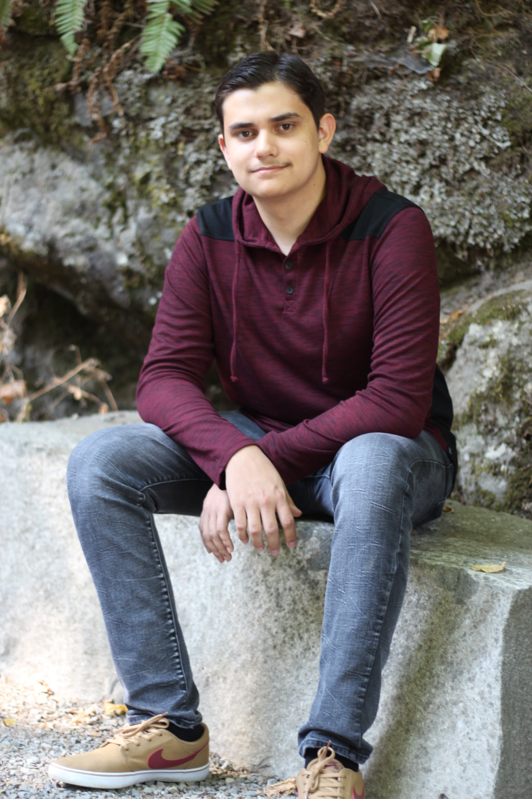

### About Me

Hello! I'm Jamal Marri, a dedicated, hardworking, and reliable Computer Science
student eager to contribute current knowledge while continuing to develop
industry skills. Successful working both independently or collaboratively within
a team on small and large software projects while at Western Washington
University. An organized planner with strong communication and analytical
skills, as well as the ability to manage multiple priorities efficiently. I’m
currently working towards my Bachelor’s and living in Bellingham, WA. Languages
that I currently have at least some experience with are: Batch, Bash, C, C++,
Java, HTML, CSS, SQL, and Racket.

{:style="width:32%"}
{:style="width:32%"}
{:style="width:32%"}

### Contact Me
Email: {{site.email}} 
[Github](https://www.github.com/{{site.github_username}}) ·
[LinkedIn](https://www.linkedin.com/in/{{site.linkedin_username}})
